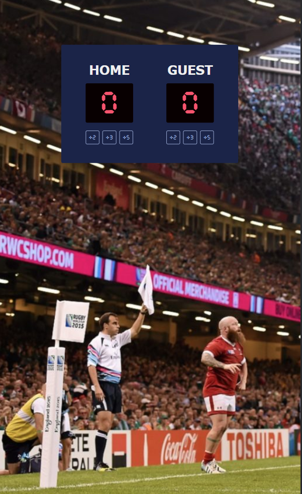
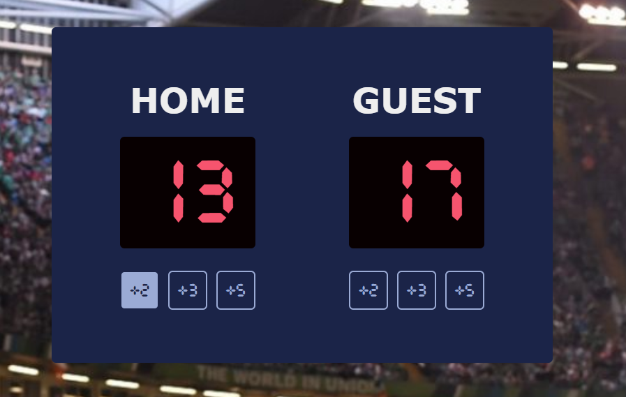

# Scrimba - The Frontend Developer Carrer Path - Module 3 - Scoreboard project

Hello and welcome! Thank you for stopping by.🤠

This is a solution to the Scoreboard projects from _Module 3 - JavaScript challenges - part 1 chapter_ of the [The Frontend Career Path](https://scrimba.com/learn/frontend).

The project was originally designed for basketball, but I adapted it for rugby game.

**For you, who doesn't know rules of rugby:**

- In rugby 5 points are scored when you score a try.
- 2 points are scored when kicking the points after the try. So a try and conversion kick is worth a total of 7 points.
- 3 points are scored by kicking a field goal.

## Table of contents

- [Overview](#overview)
  - [The project](#the-challenge)
  - [Screenshot](#screenshot)
  - [Links](#links)
- [My process](#my-process)
  - [Built with](#built-with)
  - [What I learned](#what-i-learned)
  - [Continued development](#continued-development)
- [Author](#author)
- [Acknowledgments](#acknowledgments)
- [About Scrimba](#about-scrimba)

## Overview

### The project

Users should be able to:

- Assign the desired amount of points to individual teams using the +2, +3 and +5 buttons.
- See what the score of the rugby game is.
- See hover states for interactive buttons

### Screenshot

Width: 1440px+


Width: 480px


State: Active


### Links

- Solution URL: [Github Repository](https://github.com/PetrValenta92/scoreboard)
- Live Site URL: [Github Pages](https://petrvalenta92.github.io/scoreboard/)

## My process

### Built with

- Semantic HTML5 markup
- CSS custom properties
- CSS var() functions
- CSS font-face rule
- CSS hover pseudo-class
- CSS utility classes
- Vanilla JavaScript
  - Onclick events
  - Functions
  - getElementById method
  - textContent property
- Flexbox

### What I learned

On this project, I reviewed the knowledge of HTML and CSS from earlier modules and the basics of JavaScript from the previous chapter.

Five points button:

```html
<button class="points timer-font round-border" onclick="homePlusFivePoints()">
  +5
</button>
```

```css
.points:hover {
  color: var(--dark-blue);
  background: var(--light-purple);
  border: 2px solid var(--dark-blue);
}
```

```js
let homeEl = document.getElementById("home-el");

function homePlusFivePoints() {
  homePoints += 5;
  homeEl.textContent = homePoints;
}
```

### Continued development

I will continue to follow my learning plan [The Frontend Career Path](https://scrimba.com/learn/frontend), deepening my knowledge of HTML/CSS and JS on individual projects that I will share on GitHub.

## Author

- Website - _to be added..._
- GitHub - [@PetrValenta92](https://github.com/PetrValenta92)
- LinkedIn - [@valentapetr](https://www.linkedin.com/in/valentapetr/)
- Instagram - [@petr.codes](https://www.instagram.com/petr.codes/)

## Acknowledgments

I would love to thank whole [Scrimba](https://scrimba.com) team for such amazing project they have created. Also I want to thank the Scrimba community and specialy the [Junior Guru Community](https://junior.guru/) community! 🐣

## About Scrimba

At Scrimba our goal is to create the best possible coding school at the cost of a gym membership! 💜
If we succeed with this, it will give anyone who wants to become a software developer a realistic shot at succeeding, regardless of where they live and the size of their wallets 🎉
The Frontend Developer Career Path aims to teach you everything you need to become a Junior Developer, or you could take a deep-dive with one of our advanced courses 🚀

- [Our courses](https://scrimba.com/allcourses)
- [The Frontend Career Path](https://scrimba.com/learn/frontend)
- [Become a Scrimba Pro member](https://scrimba.com/pricing)
